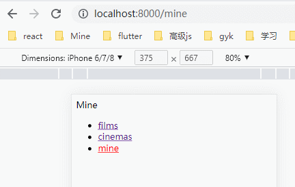
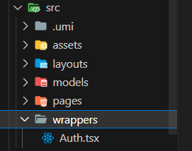
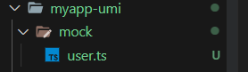

## umi project：整合了 React 全家桶的 [umi3 脚手架](https://v3.umijs.org/docs/getting-started)，react-router 是@5 版本，React 是@17 版本

### 1. 创建项目

```bash
npx @umijs/create-umi-app
```

### 2. 路由

- 配置式路由

```ts
routes: [
  { path: "/", component: "index" },
  { path: "/docs", component: "docs" },
],
```

- 约定式路由：注释.umirc.ts 中配置 routers

  - 一级路由：在 pages 下新建文件，路由约定式生成
    <br/>
    
    

  - 嵌套路由

    ```tsx
    // _layout.tsx
    import React from 'react';
    import { Redirect, useLocation } from 'umi';

    export default function Films(props: any) {
      // 路由重定向
      const location = useLocation();
      if (location.pathname === '/films' || location.pathname === '/films/') {
        return <Redirect from="/films" to="/films/nowplaying" />;
      }

      return (
        <div>
          <div style={{ height: '200px' }}>大轮播</div>
          {/* 嵌套路由 */}
          {props.children}
        </div>
      );
    }
    ```

    

  - 路由重定向：<Redirect/>

  ```tsx
  import React, { useEffect } from 'react';
  import { Redirect, useLocation } from 'umi';

  export default function Films() {
    // 重定向到NowPlaying页面
    const location = useLocation();
    if (location.pathname === '/films' || location.pathname === '/films/') {
      return <Redirect from="/films" to="/films/nowplaying" />;
    }

    return (
      <div>
        <div style={{ height: '200px' }}>大轮播</div>
        {/* 嵌套路由 */}
        {props.children}
      </div>
    );
  }
  ```

  - 404 路由：在 pages 下新建 404.tsx，所有匹配不到 pages 下面文件的路由都会默认走 404

  - 声明式导航 ：全局底部导航在 src/layouts 下做，<NavLink/>声明式跳转

  ```tsx
  import { NavLink } from 'umi';
  import styles from './index.less';

  export default function Layout() {
    if (
      location.pathname === '/login' ||
      location.pathname === '/city' ||
      location.pathname.includes('detail')
    ) {
      return <div>{props.children}</div>;
    }

    return (
      <div className={styles.navs}>
        {/* 嵌套路由，做插槽 */}
        <div>{props.children}</div>

        <ul className={styles.tabbar}>
          {['films', 'cinemas', 'mine'].map((item, index) => {
            return (
              <li key={index}>
                <NavLink to={`/${item}`} activeClassName={styles.active}>
                  {item}
                </NavLink>
              </li>
            );
          })}
        </ul>
      </div>
    );
  }
  ```

  ```less
  .navs {
    .active {
      color: red;
    }
  }
  ```

  - 编程式导航：history

  ```tsx
  import { history } from 'umi';
  history.push(`/detail/${item.filmId}`);
  ```

  - 动态路由：[id]，获取就是 id
    <br/>
    

  ```tsx
  import { useParams } from 'umi';
  const params = useParams();
  ```

  - 路由拦截：在 src/wrappers 下新建权限控制组件，包裹到需要做权限控制的页面做父组件
    

    ```tsx
    // Mine.tsx
    import React from 'react';

    export default function Mine() {
      return <div>Mine</div>;
    }
    // 给Mine组件包裹上Auth父组件，做路由拦截
    Mine.wrappers = ['@/wrappers/Auth'];
    export default Mine;

    // Auth.tsx
    import React from 'react';
    import { Redirect } from 'umi';

    export default function Auth(props: any) {
      if (localStorage.getItem('token')) {
        return <div>{props.children}</div>;
      }

      return <Redirect from="/mine" to="/login" />;
    }
    ```

  - hash 路由配置：在.umirc.ts 中配置

  ```ts
  history: {
    type: 'hash', // "browser"
  },
  ```

### 3. Mock：请求 GET 接口可用 localhost:8000/users



### 4. 反向代理：在 umirc.ts 中配置，该文件上线后不会生效，发布后的代理需要在 nginx 中配置

```ts
// 配置反向代理
proxy: {
  '/api': {
    target: 'https://i.maoyan.com',
    changeOrigin: true,
  },
},
```

### 5. 组件库集成：需要在 umirc.ts 中关闭 umi 中自带的集成组件库，下载自己想要是用的组件库版本

```ts
// 关掉默认的antd集成组件库，使用自己安装的antd版本
antd: {
  mobile: false,
},

npm i antd-mobile -S
```

### 6. 与 dva 集成连接 Redux

- 同步更新 model，获取 model

```tsx
import React from 'react';
import { connect } from 'umi';

function Cinemas(props: any) {
  // console.log(props, 'props');
  const { cityName } = props;
  return (
    <div
      onClick={() => {
        props.dispatch({
          type: 'city/changeState',
          payload: {
            cityName: item.name,
            cityId: item.cityId,
          },
        });
      }}
    >
      {cityName}
    </div>
  );
}
const mapStateToProps = (allModels: any) => ({
  a: 1,
  cityName: allModels.city.cityName,
});

export default connect(mapStateToProps)(Cinemas);
```

- 异步更新 model：

```tsx
// Cinemas.tsx
props.dispatch({
  type: 'cinema/getCinemaList',
  payload: {
    cityId,
  },
});

// cinameModel.ts
import axios from 'axios';
import { Action, CinemaList } from '../utils/state';

export default {
  namespace: 'cinema',
  state: {
    list: [],
  },
  // 异步更新state
  effects: {
    *getCinemaList(action: Action, { call, put }: any): any {
      const res = yield call(fetchList, action.payload.cityId); // 调用请求，call后面返回一个promise对象，第二个参数是传递给fetchList的
      // 同步给reducers更新state
      yield put({
        type: 'save',
        payload: res,
      });
    },
  },
  // 同步更新state
  reducers: {
    save: (prevState: CinemaList, action: Action) => {
      return { ...prevState, list: action.payload };
    },

    clearModel: (prevState: CinemaList, action: Action) => {
      return { ...prevState, list: [] };
    },
  },
};

async function fetchList(cityId: number) {
  const res = await axios({
    url: `https://m.maizuo.com/gateway?cityId=${cityId}&ticketFlag=1&k=2906283`,
    headers: {
      'X-Client-Info':
        '{"a":"3000","ch":"1002","v":"5.2.1","e":"16789325361560653676412929","bc":"310100"}',
      'X-Host': 'mall.film-ticket.cinema.list',
    },
  });
  return res.data.data.cinemas;
}
```

### FAQ：umi3 升级到 umi4：

- umi4 中路由拦截，wrappers 不生效：AuthComponent
- umi4 中没有 dva，怎么跟 model 连接：useModel?
